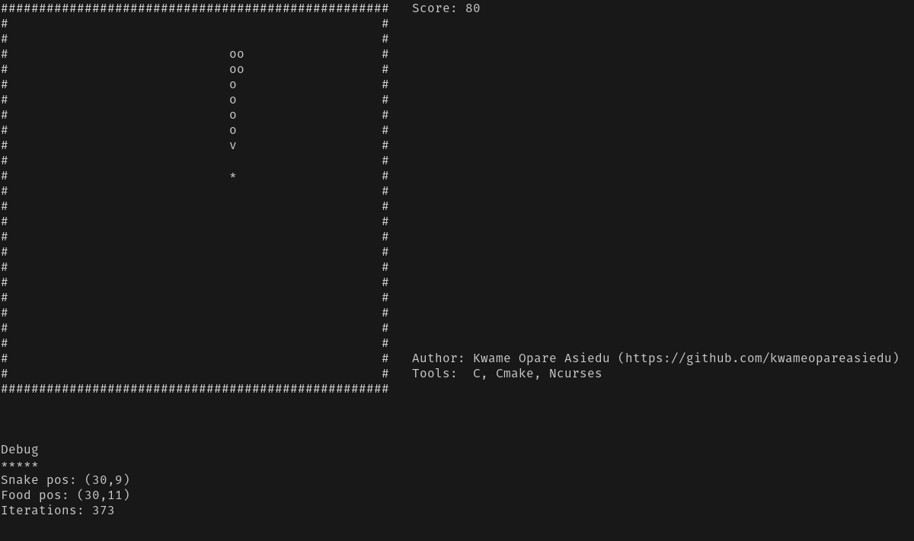

# Snake Game (CLI)

The classic snake game rebuilt using C and the **ncurses** library

### Build Source

To run the project, you'll first need to build it. For that we'll need the following installed:

- CMake (version 3.22.1 or higher)
- Ncurses library (`libncurses5-dev`)
  > Install with `sudo apt install libncurses5-dev`

Build the targets using the following steps:

1. Clone the project `git clone git@github.com:kwameopareasiedu/snake-game-cli.git`
2. Navigate to the project root `cd snake-game-cli`
3. Create a `build` folder and navigate to it `mkdir build && cd build`
4. Run cmake to create the makefile `cmake ..`
5. Run the make file to build the executables `make`

### Running the app

With our database setup, run the app using `./snake_game_cli`. You should see this in your console output:

### Issues Encountered

Here's a list of issues I encountered during development and how I resolved them.

| Issue                                      | Resolution                                     |
|--------------------------------------------|------------------------------------------------|
| `ncurses: Error opening terminal: unknown` | Add `TERM=xterm-256color` environment variable |
